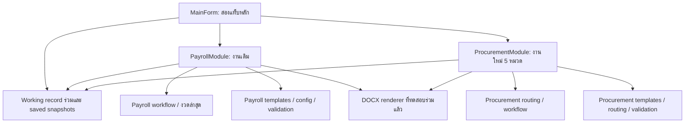
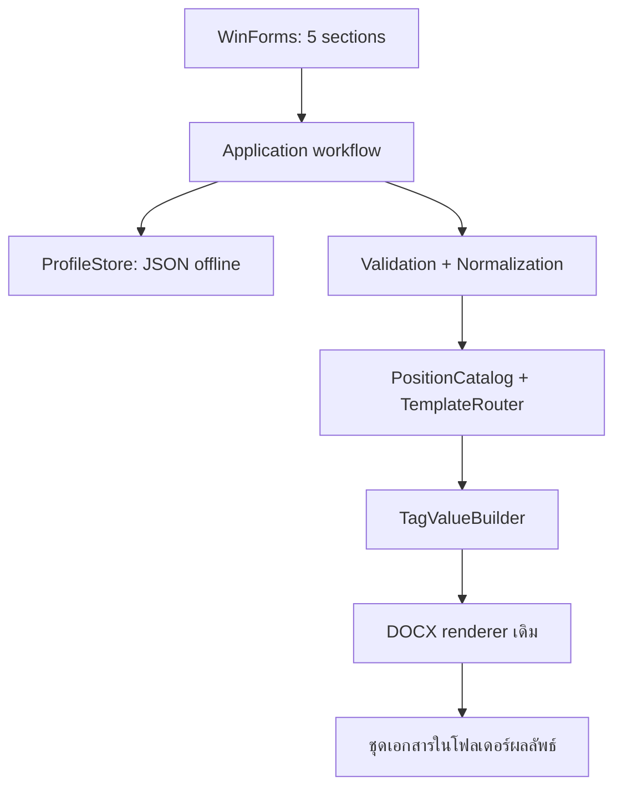

# เอกสาร 346 — Architecture Plan

วันที่: 2026-09-09 | สถานะ: READY_FOR_IMPLEMENTATION หลัง Astra review; ยังไม่ได้แก้โปรแกรมในรอบ review
Workspace เป้าหมาย: `H:\CodexProjects\346`
อ่านคู่กับ `PROJECT_CONTEXT.md` และ `IMPLEMENTATION_HANDOFF.md`

## ข้อกำหนด architecture หลัง Astra review

อ่าน findings/หลักฐาน/เกณฑ์ตรวจใน `ASTRA_REVIEW.md` ก่อนเริ่ม T01 รายละเอียดต่อไปนี้ทำให้ D01–D12 ใช้ร่วมกันได้ ไม่ใช่การเปิด grill ใหม่

| เจ้าของข้อมูล | ข้อมูลและกติกา |
|---|---|
| WorkingRecord หนึ่งชุด | ข้อมูลส่วนตัว/บัตร/การศึกษา/ที่อยู่รวมถนน, โรงเรียน/เขต/ผอ./พัสดุ/หัวหน้าพัสดุ, กรรมการ A/B/C ที่เก็บ prefix/name/surname/position แยก; สองแท็บเห็น object นี้ร่วมกันและ sync ทันที |
| PayrollState ภายใน record | position/salary ตาม baseline, เดือน/ปี/ใบสั่งจ้าง/วันที่, ผู้ลงนามการเงินและ optional หัวหน้าการเงิน, selected docs, quick-load binding และผล generate; ไม่อ่าน position/เงินจาก Procurement |
| ProcurementState ภายใน record | position จาก 5 ตำแหน่ง/flags/โรงเรียนสอง/คำสั่ง TOR/selected docs; เงินเป็นค่าคำนวณจาก catalog ของฝั่งนี้ |
| SavedTemplate | snapshot ของ shared record + input workflow ทั้งสองแท็บ มี ID ภายในและชื่อรายการที่ผู้ใช้ยืนยัน; โหลดเป็น deep copy ไม่ bind UI ตรงกับ saved object; ไม่มี SchoolId ที่ชี้ mutable school master ร่วมหลายคน |
| App preferences | รายการ custom เขต/คำนำหน้า/คุณวุฒิและ output preferences; คงได้เมื่อเพิ่มลูกจ้างใหม่ แต่ไม่เก็บ current employee/school/committee เพื่อ auto-load ครั้งหน้า |

`Template` ในปุ่มบันทึก/โหลดหมายถึงรายการข้อมูลฟอร์ม ไม่ใช่ไฟล์แม่แบบ DOCX ปุ่มชื่อเดิมบันทึกโรงเรียน/บันทึกลูกจ้างไม่ควรสร้างคนละ store: ใช้ flow `บันทึก Template` ของ record ทั้งชุดเพียง flow เดียว ข้อมูลโรงเรียน/กรรมการเป็นของแต่ละ snapshot ไม่ใช่ global singleton

การเพิ่มใหม่ล้างข้อมูล record ทั้งสองแท็บรวมโรงเรียน/ผู้ลงนาม/กรรมการ/flags/งวดของคนเดิมและ quick binding แล้วคืน control สู่ค่าเริ่มต้นของแต่ละ workflow; รายการ dropdown/defaults ที่ระบบกำหนดไม่ใช่ข้อมูลคนเก่า เปิดโปรแกรมใหม่เริ่มแบบเดียวกันและไม่โหลด draft/snapshot อัตโนมัติ โดย Payroll คง default เดือน/ปีตาม baseline และ Procurement คง default เขต/รายการเอกสารตามแผน ไม่ถือการตั้งค่าเริ่มต้นว่า dirty

Save flow ต้องคืน Saved/Cancelled/Failed ให้ caller รู้ผล; ล้างหรือปิดได้เมื่อบันทึกสำเร็จหรือผู้ใช้เลือกไม่บันทึกเท่านั้น ปิดกล่อง/X/ยกเลิกตั้งชื่อหรือ save ล้มเหลวต้องคงฟอร์ม ไม่ตีความเป็นไม่บันทึก ใช้ close guard ร่วมเพียงครั้งเดียวสำหรับ shared record และ state ทั้งสองแท็บ; generate ไม่เท่ากับบันทึกฟอร์ม

Latest-period metadata ของ Payroll แยกจาก saved field snapshot: อัปเดตเฉพาะ successful quick-load generation ของ preset เดิมตาม baseline; การพิมพ์แก้ฟอร์ม/โหลดปกติ/Procurement generate ไม่เขียนกลับ snapshot หรือเลื่อนงวด ดู R08/V06 ใน ASTRA_REVIEW

### Paths และ ownership สำหรับ T02/T06/T07

ใช้ app identity ของ 346 ที่ไม่ชน baseline `ReimbursementDocApp`; แบบเป้าหมายที่แนะนำคือ `%LOCALAPPDATA%/Document346` (ชื่อ internal เป็นรายละเอียด implementation ให้บันทึกชื่อจริงก่อนใช้):

- `App/`: EXE/config/shipped default DOCX ที่เป็นของแอปและเปลี่ยนได้เมื่อ update
- `Data/`: saved snapshots/custom lists ของ Windows user นี้
- `Template/Payroll/` และ `Template/Procurement/`: DOCX ที่ผู้ใช้ใช้งาน; seed เฉพาะไฟล์ที่ยังไม่มี ไม่ overwrite ไฟล์เดิมตอน update
- `Output/เงินเดือน/` และ `Output/เอกสารจัดจ้าง/`: ผลลัพธ์เริ่มต้น; custom output ภายนอกเก็บเป็น preference แต่ไม่เป็น owned uninstall target

Workspace master assets ยังคง `Template/<module>` และ `Config/<module>` ตาม tree ด้านล่าง; runtime paths ไม่ผูกกับ CurrentDirectory/ตำแหน่ง EXE แบบ portable และไม่ fallback ไป App creation เดิม ตรวจ relative paths ว่าอยู่ภายใน module root จริง

Fresh install ไม่ย้าย saved_templates.json เดิม; update รุ่น 346 รักษา Data/Template/Output ทั้งหมด ถ้า template ผู้ใช้ไม่เข้ากับ manifest ให้แจ้ง incompatibility รายไฟล์และไม่แทนเงียบ Uninstall จำกัด exact owned root ของ 346 และ shortcut target ของ 346 พร้อม marker/reparse checks และการลบตนเองหลัง process ออก ทดสอบใน workspace เท่านั้นก่อนใช้จริง ดู R09/V10/V11

### ข้อแก้ที่ต้องรวมใน renderer/tests

`TagValueBuilder` แบบ dictionary เป็นแกนได้ แต่ Payroll ไฟล์ 5 ต้องมี occurrence mapping ของคำนำหน้าบุคคลและ literal school-prefix ตาม `TAG_MAPPING.md` ก่อน generic replacement; ห้ามบันทึก alias กลับ template การคง renderer เดิมหมายถึงนำมาใช้และแก้เฉพาะที่จำเป็น ไม่ใช่ห้ามแก้ข้อบกพร่องด้าน formatting/path ที่ review พบ

Validation ใช้ input/snapshot ก่อนเติม prefix เพื่อไม่ให้ช่องโรงเรียนว่างกลายเป็นคำว่าโรงเรียนแล้วผ่าน required; normalize ต้องไม่เปลี่ยน record ระหว่าง capture โดยไม่ตั้งใจ แยกกฎวัน/เงิน/required ของแต่ละ module และใช้ actual generated paths ตรวจผล ไม่อ้างไฟล์ smoke จากรอบก่อน

## ส่วนเพิ่มเติมล่าสุด: สองแท็บงานในโปรแกรมเดียว

คำสั่งผู้ใช้ 2026-09-08: รวมงานเดิมและงานใหม่เป็นสองแท็บหลัก โดยโปรแกรมเก่าคือฐานใน `C:\Users\MSI\Documents\App creation` ส่วนโปรแกรมใหม่คือชุดจัดซื้อจัดจ้างและสัญญาที่กำลังวางแผนใน workspace 346 การเพิ่มนี้เป็นแผนเท่านั้น ยังไม่ย้าย source/template หรือแก้โปรแกรม

### ความเข้าใจที่ตรวจจากฐานเดิมแล้ว

อ่าน `C:\Users\MSI\Documents\App creation\HANDOFF.md`, `USER_README_TH.txt`, `template_tags.json` และส่วน workflow ใน `ReimbursementDocApp.cs` ของฐานเดิมแบบ read-only; ยังไม่ได้รันโปรแกรมเก่าในรอบนี้

| แท็บหลัก | งานและพฤติกรรมที่ต้องรักษา |
|---|---|
| **เบิกเงินเดือน** (`Payroll`) | เลือกเดือนส่งมอบ/ปี พ.ศ. → คำนวณงวด ปีงบประมาณ และวันที่เกี่ยวข้องตามฐานเดิม → กรอกหรือโหลด preset → เลือกเอกสาร → ตรวจทาน → สร้าง Word |
| **จัดซื้อจัดจ้างและสัญญา** (`Procurement`) | ข้อมูลโรงเรียน/กรรมการ TOR/ลูกจ้าง → ตำแหน่งและ flags → route TOR/ใบเสนอราคา → ตรวจข้อมูล → สร้างชุดเอกสารตามแผนใหม่ |

- Payroll มีเอกสาร 5 แบบ: หนังสือส่งเบิกจ้างเหมา, ใบส่งมอบงาน, ใบตรวจรับ, บันทึกอนุมัติเบิกจ่าย และใบสำคัญรับเงิน; ผู้ใช้เลือกสร้างบางไฟล์ได้
- Payroll มีบันทึก/จัดการ preset และ “เหมือนเดิม! แค่เปลี่ยนเดือน!” ซึ่งเสนอเดือนถัดจากงวดที่สร้างสำเร็จล่าสุดของ preset ไม่ใช่เดือนจากวันเปิดโปรแกรม; โหลดปกติไม่เลื่อนเดือน และสร้างย้อนหลังต้องไม่ถอยงวดล่าสุด
- Procurement ปัจจุบันมี 34 templates, 13 variants, ชุดเต็ม 10 ไฟล์ และขอบเขตตำแหน่งตาม context; ผู้ใช้ยืนยันว่าเอกสาร “สัญญา” ของแท็บนี้คือ `9. ใบสั่งจ้าง.docx` ที่มีอยู่แล้ว จึงไม่เพิ่มแบบสัญญาอื่น
- รายการเอกสาร Procurement เริ่มต้นติ๊กครบทุกไฟล์ แต่ผู้ใช้ยกเลิกเลือกบางไฟล์ได้ก่อนสร้าง
- ผู้ใช้ยืนยันว่ากรรมการตรวจรับของ Payroll กับกรรมการกำหนด TOR ของ Procurement เป็นบุคคลชุดเดียวกันและลำดับเดียวกัน (A = ประธาน, B/C ตามลำดับ); ให้ใช้ข้อมูลต้นทางร่วมแล้ว map เป็น tag คนละชุดตาม template โดยไม่อ่านค่าจากไฟล์เอกสารที่สร้างแล้ว

### โครงสร้างและขอบเขตข้อมูล



ใช้ WinForms `TabControl` + `TabPage` สองหน้าอยู่เหนือเนื้อหาทั้งหมด แยกแต่ละ module เป็น `UserControl`/class ที่มี state ของตนเอง โดยคง `ReimbursementDocApp.cs` เป็น entry point ย้าย UI เดิมเข้าหน้า Payroll ทีละส่วนและตรวจ regression ไม่ฝัง executable เก่าหรือเปิดโปรแกรมคนละหน้าต่างเพื่อจำลองแท็บ

| ส่วน | แผนการแยก |
|---|---|
| State | shared field values ใช้ WorkingRecord เดียว; แยกเฉพาะ workflow values, validation errors, selected documents และสถานะ generate ต่อ module; dirty = shared หรือ module ใดแก้; เปลี่ยนแท็บไม่ reset หรือเลื่อนเดือน |
| Templates | เป้าหมาย `Template/Payroll/` และ `Template/Procurement/`; resolve จาก module root แบบ explicit ไม่มี fallback ข้ามแท็บ |
| Config | เป้าหมาย `Config/Payroll/` และ `Config/Procurement/` แต่ละส่วนมี tag manifest/catalog ของตัวเอง; ปรับ loader และ build ในงานเดียวกับการย้าย path |
| Saved data | ภายใต้ data root ต่อบัญชี Windows ที่ D02 ยืนยัน แยกข้อมูล workflow ตามแท็บ แต่ record ลูกจ้าง/ข้อมูลร่วมและกรรมการใช้ร่วมกัน; รุ่นนี้เริ่มข้อมูลใหม่และไม่ย้าย `saved_templates.json` record เก่าจาก baseline |
| Output | ค่าเริ่มต้นแยก `Output/เงินเดือน` และ `Output/เอกสารจัดจ้าง` ต่อแท็บ เพื่อกันชื่อไฟล์ชน; ถ้าชื่อซ้ำให้ต่อท้าย `_2`, `_3` อัตโนมัติ |
| Shared code | shell, record/snapshot store และ renderer ที่ทดสอบแล้วใช้ร่วม; กฎวันที่/เงิน/required fields เป็นของแต่ละ module ไม่ใช้ validation ชุดเดียว |

รองรับ Windows 10/11. Installer รุ่นอัปเดตต้องไม่ลบหรือแทนที่ข้อมูลลูกจ้าง, Template และ Output ของผู้ใช้; Uninstaller ทำได้ตามเจตนาเจ้าของโปรแกรม แต่ต้องลบได้เฉพาะ install root และ shortcut ของแอปที่ตรวจ path ตรงตัวเท่านั้น

ผู้ใช้ยืนยัน 2026-09-08 ให้บันทึกข้อมูลการจ้างเป็นรายบุคคล เครื่องเดียวมีลูกจ้างจากหลายโรงเรียนได้ โดย `{ชื่อโรงเรียน}` อยู่ใน record รายบุคคล ไม่ต้องมี active school เดียวหรือเมนูสลับโรงเรียนในรุ่นนี้ ข้อมูลลูกจ้างร่วมกันระหว่าง Payroll และ Procurement และแก้ในแท็บหนึ่งต้องเห็นอีกแท็บทันที อย่างน้อยชื่อ เลขประชาชน ที่อยู่ และชุดกรรมการเป็นข้อมูลต้นทางเดียวกัน ส่วนงวด/preset Payroll และ routing/คำสั่ง TOR Procurement เป็นข้อมูลเฉพาะโมดูล

### แบบ implementation: หนึ่ง EXE สอง module

ใช้แอปเดียว หน้าต่างเดียว และ installer เดียว ไม่ต้องมีระบบ plugin หรือ process สองตัว ชื่อ class/โฟลเดอร์ต่อไปนี้เป็นแบบเป้าหมาย ยังไม่ได้สร้างจริง

```text
H:\CodexProjects\346\
  ReimbursementDocApp.cs       Program.Main + MainForm ที่เป็น shell
  Modules/
    Payroll/
      PayrollView.cs          UI เดิมที่ย้ายมาเป็น UserControl
      PayrollWorkflow.cs      งวด/วันที่/preset/validation/สร้างชุดเบิก
    Procurement/
      ProcurementView.cs      UI ใหม่ 5 หมวด
      ProcurementWorkflow.cs  profile/TOR/routing/สร้างชุดจ้าง
  Shared/
    DocxRenderer.cs           แทน tag; ส่ง template path และ values เข้ามา
    ModulePaths.cs            กำหนด root ของแต่ละ module ชัดเจน
  Config/
    Payroll/                 template_tags.json + app_database.json ของเดิม
    Procurement/             template_tags.json + app_database.json ของใหม่
  Template/
    Payroll/                 5 แบบเดิมที่ตรวจแล้ว
    Procurement/             34 แบบใหม่ พร้อม subfolder เดิม
  build-exe.ps1
  build-installer.ps1
  Installer.cs
  Uninstaller.cs
  DocxSmokeTest.cs
  dist/                      build ใหม่เท่านั้น
  release/                   package ใหม่เท่านั้น
```

แบ่งไฟล์ตามหน้าที่ข้างต้นเมื่อช่วยให้ย้ายโค้ดได้ชัด ไม่ต้องเพิ่ม repository/service/interface ทุก class; models ขนาดเล็กอยู่ในไฟล์ module ได้ build-exe ต้องระบุรายการ source ที่จะ compile อย่างชัดเจน ไม่ glob `.cs` ทุก subfolder จนรวม source เก่าหรือ smoke test เข้า EXE

**หน้าที่ shell:** สร้าง views ครั้งเดียว ส่ง paths และ shared WorkingRecord ให้ทั้งสอง module แสดงสองแท็บ จัดการ close guard/saved record transition และสถานะกำลังสร้าง Shell ไม่อ่าน tag ไม่คำนวณเงิน/วันที่ และไม่รวม output tag dictionary ของสอง module เข้าด้วยกัน

**ข้อตกลงระหว่าง shell กับ module:** แต่ละ module แจ้งชื่อ, มีข้อมูลยังไม่บันทึกหรือไม่, กำลังทำงานหรือไม่ และรับคำสั่งตรวจ/บันทึกก่อนปิดผ่าน methods/events ปกติ การเลือกแท็บไม่มี side effect ต่อข้อมูล แท็บ “เบิกเงินเดือน” อยู่ซ้าย แท็บ “จัดซื้อจัดจ้างและสัญญา” อยู่ขวา และเปิดโปรแกรมครั้งแรกที่แท็บ “จัดซื้อจัดจ้างและสัญญา” ตามคำตอบผู้ใช้

**การสร้างเอกสาร:** ปุ่มในแต่ละ view ส่ง snapshot ไป workflow ของตัวเอง → validate → resolve ชุดไฟล์และ values → renderer → ตรวจผล → บันทึกสถานะสำเร็จเฉพาะ module นั้น ห้าม renderer อ่าน controls หรือเปลี่ยน preset เอง; การอัปเดตงวด Payroll ทำเมื่อเอกสารที่เลือกสร้างสำเร็จครบเท่านั้น

**โค้ดที่แชร์อย่างระวัง:** ชื่อ method เหมือนกันไม่ได้แปลว่าพฤติกรรมเหมือนกัน ต้องเทียบ renderer ของฐานเดิมกับ workspace ใหม่ก่อนรวม โดยเฉพาะ normalization/การจัดย่อหน้าลายเซ็น หากมีข้อแตกต่างเฉพาะ template ให้คง rule ใน module แล้วใช้แกนแทน tag ร่วม ไม่ปรับ layout ของทั้งสองฝั่งพร้อมกันโดยปริยาย

**เมื่อเกิดปัญหา:** config/template ของแท็บหนึ่งเสีย ให้แท็บนั้นแจ้งปัญหาและปิดการสร้างเอกสารเฉพาะฝั่งนั้น โดยไม่โหลด config จากอีกแท็บแทน การปิดโปรแกรมต้องตรวจข้อมูลค้างทั้งสองแท็บ: แสดงตัวเลือก `บันทึก` หรือ `ไม่บันทึก`; กากบาทของกล่องถามปิดกล่องและกลับไปทำงานต่อ; หากบันทึกล้มเหลวต้องแจ้งและไม่ปิดโดยเงียบ

**ข้อมูลที่ใช้ร่วม:** ใช้ record ลูกจ้างรายบุคคลเป็นแหล่งข้อมูลร่วมของสองแท็บ และสะท้อนการแก้ไขข้ามแท็บทันทีตาม field ที่ยืนยันแล้ว; อย่ารวมข้อมูลเฉพาะ workflow เข้าด้วยกัน และอย่าให้ renderer อ่านไฟล์ output ของอีกแท็บเพื่อส่งต่อค่า

### แผนย้ายฐานเดิมอย่างจำกัด

1. บันทึก hash และ inventory ฐาน Payroll; source หลักที่อ่านได้ตรง baseline เดิม `AF39CDA8455B9517453DCDAAB6A956B63AB65747DE439CC7F72826016878F35A`
2. ตรวจ template ต้นทาง Payroll จาก `App creation/dist/Template` ตาม HANDOFF เก่า แล้วคัดลอกเฉพาะ 5 DOCX ที่ manifest ใช้ พร้อม source/config ที่จำเป็นมา workspace 346 ในขั้น implementation; ไม่คัดลอก dist/release ทั้งชุด ไม่ใช้ binary/output เก่า และไม่แก้ต้นทาง
3. Template 34 ไฟล์ใน workspace 346 เป็นฝั่ง Procurement ให้ย้ายเข้า module root โดยปรับ relative paths, tag manifest, tests และ packaging พร้อมกัน ไม่มีการทิ้ง loader ให้ชี้ path เก่า
4. ปรับ build ให้ compile module ทั้งคู่และ copy templates/config แบบแยก root; package จาก workspace 346 เท่านั้น รันได้แม้ไม่มีโฟลเดอร์ App creation บนเครื่องปลายทาง

### การสลับแท็บและเกณฑ์ตรวจรับ

- แสดงชื่อแท็บเต็มตลอด; ปุ่มสร้างและสรุปผลบอกชนิดงานชัด ผู้ใช้สลับกลับมาเจอข้อมูลเดิมโดยไม่ต้องบันทึกก่อนทุกครั้ง
- หมวด 1–5 และ UX plan ที่มีอยู่เป็นเนื้อหาภายใน Procurement ส่วน Payroll รักษาขั้นตอนเดิม ไม่บังคับกรอก TOR/เลขประชาชนหรือ field ใหม่ที่งานเก่าไม่เคยต้องใช้
- สลับแท็บไม่สร้างไฟล์ ไม่ save อัตโนมัติ ไม่เลื่อนงวด; เมื่อปิดโปรแกรมตรวจ dirty state ทั้งสองแท็บ
- ระหว่างสร้างเอกสารให้ล็อกการสร้าง/สลับแท็บชั่วคราวจนจบ และแสดงชื่อโมดูลกับ progress จริง เพื่อไม่ให้ปุ่มหรือผลลัพธ์ไปผิดงาน
- ทดสอบ Payroll เทียบ baseline: 5 แบบเอกสาร, เลือกบางไฟล์, save/load preset, quick-next-month, เปลี่ยนปี, สร้างย้อนหลัง และความล้มเหลวต้องไม่เลื่อนงวดล่าสุด
- ทดสอบ Procurement ตามเกณฑ์ 13 variants เดิม และทดสอบสลับแท็บไปกลับแล้วข้อมูล/template/output ไม่รั่วข้ามกัน
- จำนวน template เป้าหมายเริ่มต้นรวม 39 ไฟล์ = Payroll 5 + Procurement 34 ให้ตรวจ inventory จริงก่อนล็อก; เกณฑ์ 34 ไฟล์ในแผนเดิมหมายถึง Procurement เท่านั้น

ลำดับงานเพิ่มเติม: ขยาย T01 ให้ตรวจฐานทั้งสอง → วาง shell/module boundary ก่อน T02–T05 → ขยาย T06/T07 ให้ทดสอบและ package ทั้งสองแท็บ ห้ามใช้กฎ cleanup 5 ตำแหน่งของ Procurement ไปตัดความสามารถ Payroll โดยอัตโนมัติ

จุดตรวจการรวมโปรแกรม (เป็นรายละเอียดของ T01–T07 ไม่ใช่การรีเซ็ตงานเดิม):

| จุดตรวจ | ผลที่ต้องได้ก่อนเดินต่อ |
|---|---|
| I01 เก็บ baseline | มี manifest/hash และตัวอย่างผล Payroll ที่ใช้เทียบได้; source ต้นทางคงเดิม |
| I02 แยก Payroll เข้าสู่ shell | มีสองแท็บ; Payroll ยังใช้ 5 แบบเดิมได้ ส่วน Procurement แสดงสถานะรอพัฒนาอย่างตรงไปตรงมา |
| I03 เชื่อม Procurement | ใช้ 5 หมวด/13 variants กับ model และ paths ของตนเอง ไม่มีการยืม controls/state Payroll |
| I04 ทดสอบการแยก | สลับแท็บค่าคงเดิม; generate ฝั่งหนึ่งไม่เปลี่ยนงวด/profile อีกฝั่ง; config ขาดฝั่งหนึ่งไม่ทำให้ใช้ manifest ผิดฝั่ง |
| I05 ตรวจ distribution | build ทั้งสอง module จาก workspace, smoke ทั้งสองชุดผ่าน, installer ใช้ artifact ที่ตรวจแล้ว และรันได้โดยไม่มี project ต้นทาง |

โค้ดต้องอ่าน assets ของแอปจากโฟลเดอร์ติดตั้งใหม่เท่านั้น ข้อห้ามอ้างอิง C:/Desktop หมายถึงไฟล์โปรเจกต์/template/config เก่า ไม่ใช่ห้ามใช้ Windows/.NET runtime หรือ user data root ที่ D02 อนุมัติซึ่งอาจอยู่บนไดรฟ์ C:

ส่วนถัดไปเป็นรายละเอียด **Procurement** เดิม เว้นแต่ระบุว่าใช้ร่วมกัน

## 1. หลักที่ใช้ตัดสินใจ

- ใช้ข้อกำหนดใน PROJECT_CONTEXT ฉบับล่าสุดเป็นหลัก แผนนี้ไม่เปลี่ยนกฎที่ล็อกไว้
- ข้อมูลใหม่ต้องบันทึกคำตอบและผลกระทบก่อนลงมือ ห้ามเดาว่าคำถามที่ยังว่างได้รับคำตอบแล้ว
- คง Windows C# WinForms และ build เดิม ไม่ย้าย framework หรือเพิ่ม server/cloud
- แยกหน้าที่ในโค้ดทีละส่วน โดย `ReimbursementDocApp.cs` ยังเป็น entry point/source หลัก ไม่ rewrite ทั้งโปรแกรม
- แก้เฉพาะ workspace เป้าหมาย ห้ามแตะ `C:\Users\MSI\Documents\App creation` และห้าม commit/push โดยไม่มีคำสั่ง
- งานนี้เฉพาะ schoolPositions 5 ตำแหน่ง ไม่รวม khetPositions และตำแหน่งที่แยกทำภายหลัง

## 2. ข้อเท็จจริงจากการอ่านไฟล์ปัจจุบัน

- โปรแกรมใช้ WinForms; build ผ่าน `csc.exe` ใน .NET Framework v4.0.30319 ไม่ใช่โครงการ dotnet SDK
- มีการเก็บข้อมูลเดิมใน `saved_templates.json` ข้าง executable ต้องตรวจโครงสร้างจริงก่อนย้ายข้อมูล
- มี `RenderDocx` และตัวแทน tag ผ่าน XML อยู่แล้ว; smoke test เรียกบาง method ด้วย reflection ต้องปรับ test พร้อมกันหากเปลี่ยนชื่อ/ตำแหน่ง
- Template ปัจจุบันนับได้ 34 DOCX; inventory 56 tags เป็นข้อมูลตาม PROJECT_CONTEXT ต้องสแกนใหม่ตอนเริ่ม implementation
- `build-exe.ps1` ยังไม่ copy Template; `build-installer.ps1` ยังมี fallback ไป Desktop/Downloads, copy แบบชื่อไฟล์ล้วน และส่วนเชื่อม jmoney เก่า ต้องแก้ก่อนใช้ปล่อยรุ่น

## 3. โครงสร้างที่เสนอ



| ส่วน | หน้าที่ / ขอบเขต |
|---|---|
| MainForm | รับค่า แสดง error และ checkbox; ไม่คำนวณ routing ซ้ำใน event หลายจุด |
| RecordSchoolData | โรงเรียน, เขต, ผอ./พัสดุ/หัวหน้าพัสดุ ภายใน record รายบุคคล ไม่มี school master ที่เปลี่ยน snapshot ของคนอื่น |
| EmployeeRecord | ID, ข้อมูลส่วนตัว/บัตร/การศึกษา/ที่อยู่, RecordSchoolData, committee A/B/C และ inputs ของสอง workflows; เลขประชาชนเป็น string |
| ProcurementDraft | PositionId, HasTeaching, WorksAtTwoSchools, SecondSchoolName, คำสั่ง TOR และ selected documents เป็น workflow ของ record ปัจจุบัน |
| PositionCatalog | 5 ตำแหน่ง, เงินตาม mapping, checkbox ที่แต่ละตำแหน่งใช้ได้ |
| TemplateRouter | รับ PositionId + flags แล้วคืนคู่ path ขั้นตอน 3/6; ค่าที่ไม่รองรับต้อง error |
| TagValueBuilder | แปลงข้อมูลที่ validate แล้วเป็น dictionary สำหรับ renderer; placeholder ใช้เฉพาะตอนส่งออก |
| ProfileStore | อ่าน/เขียน JSON แบบมี schemaVersion, backup และ migration; ไม่พึ่ง UI controls |

หมายเหตุจาก D01/D12: ไม่สร้าง SchoolProfile/SchoolId แบบ master ร่วมข้ามคนในรุ่นนี้; school data และ committee อยู่ภายในแต่ละ record snapshot ส่วนสองแท็บแชร์ working record ปัจจุบันเดียวกัน

ชื่อ model/class เป็นข้อเสนอ ไม่ใช่ชื่อที่มีอยู่แล้ว เริ่มแยกเป็น class ภายใน source หลักได้; ถ้าแยกไฟล์ `.cs` ต้องปรับรายการ compile ใน build เดียวกันให้ครบ ใช้ syntax และ library ที่ compiler เดิมรองรับ

### การเก็บข้อมูลที่เสนอ

ใช้ JSON local ต่อจาก baseline โดยแยก shipped defaults (`app_database.json`) ออกจากข้อมูลที่ผู้ใช้บันทึก ไม่ต้องเพิ่มฐานข้อมูลใหม่ในรอบนี้ ข้อมูลผู้ใช้เก็บต่อบัญชี Windows ใต้ `%LOCALAPPDATA%` และเริ่มข้อมูลใหม่โดยไม่ migrate preset เก่าของ baseline

โครงสร้างเชิงแนวคิด: `schemaVersion`, saved record snapshots และรายการ custom เช่น `districts[]`; ชุดกรรมการร่วมหมายถึงร่วมข้ามแท็บภายในแต่ละ record ไม่ใช่กรรมการ global ของทั้ง store โดย `{ชื่อโรงเรียน}` อยู่ใน record การจ้างรายบุคคล ใช้ ID ภายใน ไม่ใช้ชื่อหรือเลขประชาชนเป็น key/ชื่อไฟล์จริง ชื่อ Template เป็น display name ที่ผู้ใช้ยืนยัน และไม่ต้องมี `activeSchoolId` ใน UX รุ่นนี้

ตำแหน่งเก็บจริงตาม D02: เก็บข้อมูลผู้ใช้แยกตามบัญชี Windows ใต้ `%LOCALAPPDATA%` ไม่แชร์ทุก user ต่อเครื่อง และไม่ทำ portable data ในรุ่นนี้

เขียนไฟล์ชั่วคราวแล้วแทนไฟล์หลักเมื่อสำเร็จ; ถ้า JSON เสียหรือ schema ใหม่กว่าโปรแกรม ให้แจ้งและไม่เขียนทับด้วยฐานว่าง และไม่เอาข้อมูลผู้ใช้จริงเข้า installer/source zip การติดตั้งรุ่นนี้ไม่ย้าย `saved_templates.json` เก่าของ baseline

### รองรับคำตอบเรื่องโรงเรียนโดยไม่รื้อ model

- D01 = หลายโรงเรียนต่อเครื่องในระดับ record: เก็บ `{ชื่อโรงเรียน}` กับข้อมูลการจ้างรายบุคคล ไม่แสดงเมนู active-school/switch school ในรุ่นนี้
- ข้อมูลที่ใช้ร่วมกันต้องอ้างอิง record ลูกจ้างเดียวกันระหว่างสองแท็บ และสะท้อนการแก้ไขทันทีตาม field ที่ยืนยันแล้ว

## 4. กฎกลางที่ implementation ต้องรักษา

Routing ใช้ตาราง explicit ตามไฟล์จริงใน PROJECT_CONTEXT ห้ามเดาชื่อด้วย fuzzy matching หรือ fallback ไป variant อื่น

| ตำแหน่ง | flags ตามลำดับ | ขั้นตอน 3 / 6 |
|---|---|---|
| ธุรการ 9,000 | ไม่ติ๊ก / 2 โรงเรียน / สอน / ทั้งคู่ | 3.1.1–3.1.4 / 6.1.1–6.1.4 |
| ธุรการ 15,000 | ไม่ติ๊ก / 2 โรงเรียน / สอน / ทั้งคู่ | 3.2.1–3.2.4 / 6.2.1–6.2.4 |
| นักการภารโรง | ไม่มี flags | 3.3 / 6.3 |
| พี่เลี้ยงเด็กพิการ | ไม่สอน / สอน | 3.4.1–3.4.2 / 6.4.1–6.4.2 |
| ครูพักนอน | ไม่สอน / สอน | 3.5.1–3.5.2 / 6.5.1–6.5.2 |

- กลาง 8 ไฟล์ + TOR 1 + ใบเสนอราคา 1 = 10 ไฟล์ต่อชุดเต็ม (ขั้นตอน 2 มี 2 ไฟล์); รวม 13 routing variants
- เงินรวม/เงินรวมTEXT ใช้ static mapping ไม่คูณ 12 runtime; บาทอากร = เงินรวม / 1000 ส่งเฉพาะเลข
- ตรวจ mandatory fields ตาม context และกรรมการ A/B/C ให้ครบ; เลขประชาชนเป็นตัวเลข 13 หลัก รักษา 0 นำหน้า ไม่เพิ่ม checksum เป็นข้อบังคับเอง
- `{คำสั่งสเปค}` เป็น optional; ค่าว่างต้องถูกแทนด้วยจุดในเอกสาร และค่าที่กรอกเป็นของ record การจ้างรายบุคคล
- `{ถนนลูกจ้าง}` เป็น field ร่วมในข้อมูลส่วนตัว/ที่อยู่ กรอกได้แต่ไม่บังคับและจำรายบุคคล; Payroll ใช้แทน tag ตาม baseline และ Procurement ไม่ส่งออก field นี้
- เมื่อเปลี่ยนตำแหน่ง ต้อง reset flags ที่ใช้ไม่ได้; โรงเรียนสองบังคับเฉพาะเมื่อเลือก 2 โรงเรียน และไม่ส่งค่าเก่าตอนปิด
- Trim/normalize ตาม field; prefix โรงเรียน/เขต/ที่อยู่ไม่ซ้ำ และ normalize ซ้ำแล้วผลคงเดิม
- วันเกิด/บัตร/อายุ/การศึกษา/ที่อยู่ปล่อยว่างได้; ส่ง `.............` ตาม field และไม่ส่งข้อความ `(กรอกเอง)` ลงเอกสาร อายุกรอกเอง
- รายการ dropdown และ tag spelling ให้ยึด PROJECT_CONTEXT ไม่สร้างรายการใหม่จากความจำ
- ปุ่มเพิ่มลูกจ้างใหม่ต้องถามก่อนว่าจะบันทึกข้อมูลปัจจุบันเป็น Template ตามชื่อ–นามสกุลหรือไม่ แล้วเรียก flow บันทึก Template เดียวกับปุ่มหลักเมื่อเลือกบันทึก; ไม่ว่าผลจะบันทึกหรือไม่ หลังจบคำถามต้องล้างข้อมูลฟอร์มของ record ปัจจุบันทั้งหมด แล้วเริ่ม record ใหม่
- การโหลด Template เป็นการนำข้อมูลมาใช้ในฟอร์ม ไม่แก้ record ที่บันทึกไว้โดยอัตโนมัติ และต้องแจ้งผู้ใช้ว่าการเปลี่ยนข้อมูลเดิมจะเกิดเมื่อสั่งบันทึกทับชื่อเดิมเท่านั้น
- คงรูปแบบและ font ของ template และรองรับ tag แบ่งข้าม Word runs ใน body/header/footer
- ปีงาน 2570 ช่วง 1 ตุลาคม 2569–30 กันยายน 2570; ห้ามแก้ปีในไฟล์ขั้นตอน 9 เองตามข้อห้ามเดิม

## 5. เส้นทางสร้างเอกสารและการปล่อยรุ่น

1. Capture ค่าเป็น snapshot → normalize → validate → resolve template paths
2. ตรวจไฟล์และ tag mapping ก่อนสร้าง → render ไปโฟลเดอร์ชุดงานชั่วคราว
3. ตรวจ tag ค้างและจำนวนไฟล์ → แสดงผลสำเร็จเมื่อครบ; ถ้าล้มเหลวแจ้งไฟล์/เหตุผล ไม่อ้างว่าชุดสมบูรณ์ และไม่เขียนทับชุดเดิมโดยเงียบ
4. Build ใช้ Template ภายใน workspace เท่านั้น แล้ว copy recursive โดยรักษา subfolder ทั้ง dist และ payload; ตรวจ exit code ทุกขั้น
5. Smoke test Procurement 13 variants/34 templates และ Payroll 5 templates; ตรวจ visual QA ทั้ง 39 แบบหลัง render ก่อนปล่อยใช้งาน หากไม่มี Word/renderer ให้บันทึก gate ที่ยังไม่ตรวจตาม D10 โดยยังสร้าง DOCX ได้
6. Build installer ได้หลัง smoke ผ่านเท่านั้น; ตัว installer ต้องใช้ payload เดียวกับที่ตรวจแล้ว ถ้า rebuild ใหม่ต้องตรวจใหม่ก่อน package

## 6. เกณฑ์เสร็จ

Procurement active 5 รายการ/routing 13 แบบ และ Payroll คง baseline 11 schoolPositions/5 เอกสาร; validation/การจำข้อมูลทำงานตามคำตอบ, semantic values ถูกต้อง, ไม่มี tag ค้างหรือข้อมูลผิดคน, formatting ผ่านการตรวจตามจริง และติดตั้งทดสอบแล้วพบ Template 39 ไฟล์ใน module paths ที่ถูกต้อง ไม่มี artifact เก่าหรือข้อมูลผู้ใช้ปะปน ต้องผ่าน V01–V12 ใน ASTRA_REVIEW โดยรายงาน gate ที่ยังไม่ได้ตรวจแยกชัด

แผนนี้ยังไม่ใช่หลักฐานว่า build/test ผ่าน ดูลำดับงานและสถานะจริงใน IMPLEMENTATION_HANDOFF
