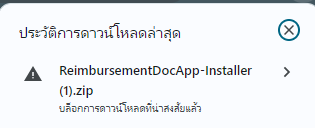
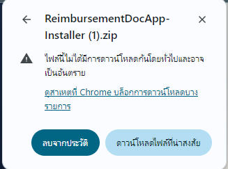
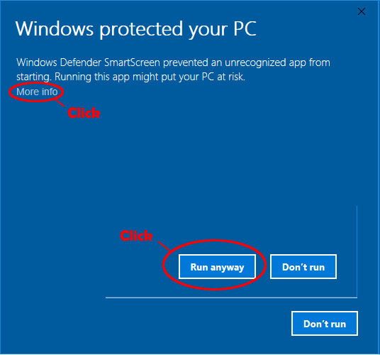
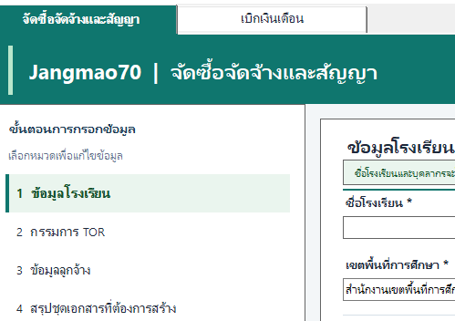
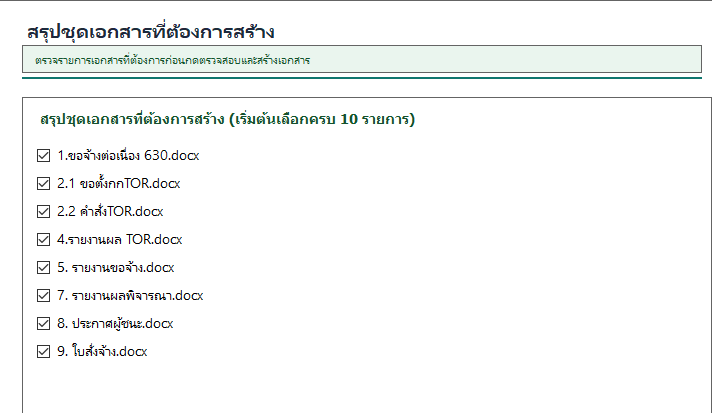
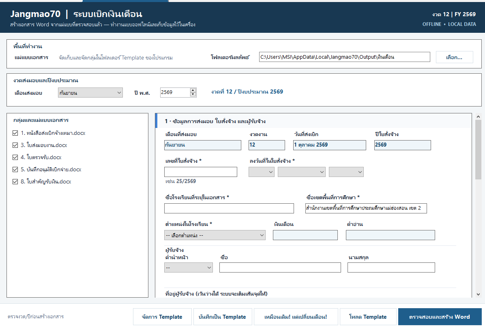
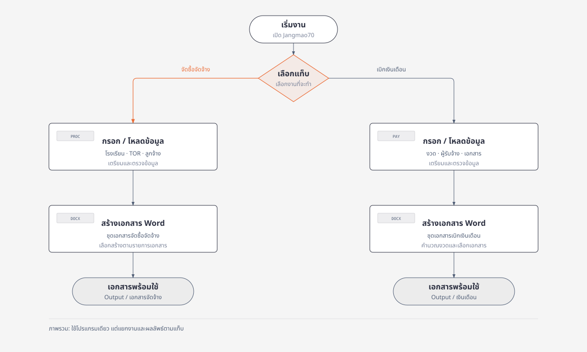
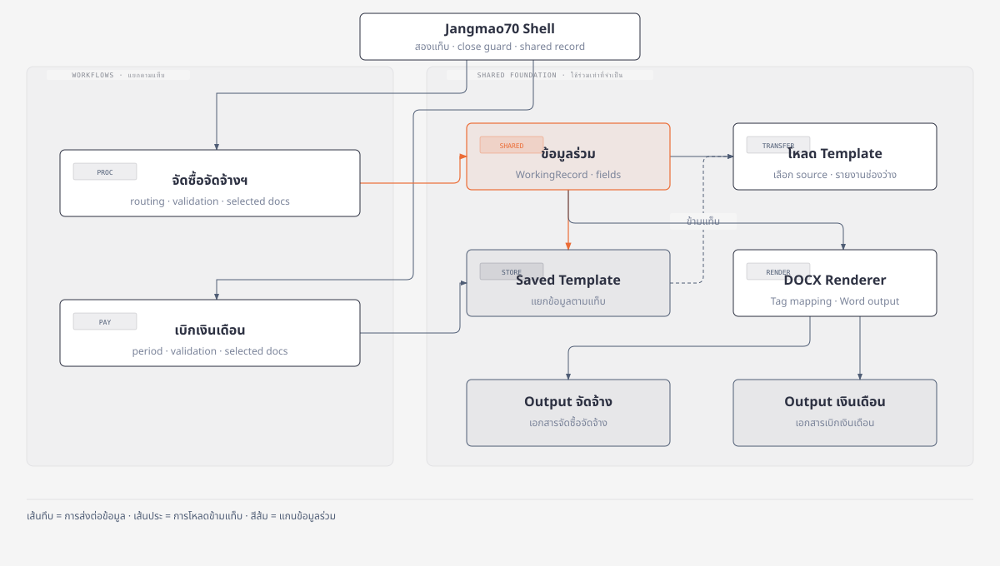

<div align="center">

<a href="https://robbygrean.github.io/Jangmao70/">
  
</a>

<p>
  
  
  
  
</p>

### งานเอกสารสองแบบ จบในโปรแกรมเดียว

โปรแกรมช่วยกรอกข้อมูลและสร้างเอกสาร **Word** สำหรับ Windows<br>
**จัดซื้อจัดจ้างและสัญญา · เบิกเงินเดือน**<br>
กรอกหรือโหลดข้อมูล → ตรวจสอบ → สร้างเอกสาร พร้อมเก็บผลลัพธ์ไว้ในเครื่อง

<a href="https://robbygrean.github.io/Jangmao70/">
  
</a>

**[เปิดเว็บไซต์และดาวน์โหลดโปรแกรม](https://robbygrean.github.io/Jangmao70/)**

<p>
  <a href="https://robbygrean.github.io/Jangmao70/guide.html"></a>
  <a href="./assets/downloads/Jangmao70-Source.zip"></a>
</p>

[ความสามารถ](#ความสามารถ) · [เริ่มใช้งาน](#เริ่มใช้งาน) · [ภาพโปรแกรมจริง](#ภาพโปรแกรมจริง) · [ดาวน์โหลดและคู่มือ](#ดาวน์โหลดและคู่มือ)

</div>


## ความสามารถ

| จัดซื้อจัดจ้างและสัญญา | เบิกเงินเดือน |
| :--- | :--- |
| กรอกข้อมูลสำหรับงานจัดซื้อจัดจ้างและสัญญา | กรอกข้อมูลสำหรับงานเบิกเงินเดือน |
| ตรวจรายการเอกสารก่อนสร้างจากแม่แบบ Word | เลือกงวดและรายการเอกสารที่ต้องการสร้าง |
| เก็บ Template ข้อมูลและผลลัพธ์ของงานจัดจ้างแยกไว้ | เก็บ Template ข้อมูลและผลลัพธ์ของงานเงินเดือนแยกไว้ |

**ใช้ข้อมูลร่วมได้** — ชื่อ ที่อยู่ และข้อมูลกรรมการที่เกี่ยวข้องสามารถนำไปใช้กับอีกแท็บผ่านการโหลด Template โดยตรวจรายงานก่อนยืนยันการนำเข้าข้ามงาน

**ทำงานในเครื่อง** — ข้อมูลและเอกสารทำงานแบบ local ไม่ต้องใช้ npm หรือระบบ cloud เพื่อใช้งานโปรแกรม

**เก็บข้อมูลไว้ใช้ต่อ** — บันทึก Template เพื่อโหลดข้อมูลในฟอร์มกลับมาใช้ครั้งถัดไป โดยงวดเบิก รายการเอกสาร และ Output ยังคงแยกตามแท็บ

## เริ่มใช้งาน

1. ไปที่ **[หน้าดาวน์โหลด Jangmao70](https://robbygrean.github.io/Jangmao70/)** แล้วดาวน์โหลด Installer
2. แตกไฟล์ ZIP และเปิด **`Jangmao70-Setup.exe`**
3. เปิดโปรแกรม แล้วเลือกแท็บ **จัดซื้อจัดจ้างและสัญญา** หรือ **เบิกเงินเดือน**
4. กรอกข้อมูลหรือโหลด Template ตรวจสอบข้อมูล แล้วสร้างเอกสาร Word

> [!TIP]
> คู่มือรวมวิธีติดตั้ง คำเตือนจาก Chrome/Windows การโหลด Template ข้ามงาน และการสร้างเอกสารไว้แล้ว → **[อ่านคู่มือภาษาไทย](https://robbygrean.github.io/Jangmao70/guide.html)**


## ดาวน์โหลดหรือติดตั้งแล้วเจอคำเตือน

### Chrome เตือนไฟล์มีความเสี่ยง

1. เปิดรายการดาวน์โหลด แล้วคลิกลูกศรหรือรายการไฟล์ที่มีคำเตือน
2. ตรวจแหล่งที่มาเป็น **RobbyGrean/Jangmao70** และชื่อไฟล์ **Jangmao70-Installer.zip**
3. เมื่อตรวจสอบและเชื่อถือแล้ว คลิก **ดาวน์โหลดไฟล์ที่น่าสงสัย** (บางรุ่นใช้ **Keep / เก็บไว้** หรือ **Keep anyway / เก็บไว้ต่อไป**)
4. แตก ZIP ก่อนเปิด **Jangmao70-Setup.exe**

| เปิดรายการที่ถูกเตือน | เลือกดาวน์โหลดต่อ |
| :---: | :---: |
|  |  |

ภาพ Chrome มาจาก jmoney รุ่นก่อน ชื่อไฟล์ในภาพจึงต่างกัน สำหรับโปรแกรมนี้ให้ตรวจชื่อ **Jangmao70-Installer.zip**

### Windows protected your PC — More info → Run anyway

1. เมื่อขึ้น **Windows protected your PC** คลิก **More info / ข้อมูลเพิ่มเติม**
2. ตรวจชื่อแอปให้เป็น **Jangmao70-Setup.exe** จากไฟล์ที่ดาวน์โหลดจากเว็บไซต์ทางการ
3. คลิก **Run anyway / เรียกใช้ต่อไป** ที่ปรากฏขึ้น แล้วทำตามหน้าต่างติดตั้ง



SmartScreen อาจเตือนเมื่อแอปยังไม่มีชื่อเสียงเพียงพอหรือไม่มีลายเซ็นที่ระบบรู้จัก ทำต่อเฉพาะไฟล์ที่ตรวจสอบและเชื่อถือ หากไม่มีปุ่ม Run anyway ให้ติดต่อผู้ดูแลเครื่อง เพราะนโยบายองค์กรอาจไม่อนุญาต

[ดูภาพและขั้นตอนบนเว็บไซต์](https://robbygrean.github.io/Jangmao70/#download-help) · [อ่านคู่มือการติดตั้ง](https://robbygrean.github.io/Jangmao70/guide.html#smartscreen)


## ภาพโปรแกรมจริง

### จัดซื้อจัดจ้างและสัญญา

| ข้อมูลโรงเรียน | ตรวจชุดเอกสาร |
| :---: | :---: |
| [](./assets/screenshots/procurement-school.png) | [](./assets/screenshots/procurement-documents.png) |

### เบิกเงินเดือน

[](./assets/screenshots/payroll-window.png)

<p align="center"><a href="https://robbygrean.github.io/Jangmao70/#screenshots">ดูสไลด์ภาพโปรแกรมบนเว็บไซต์ →</a></p>

## จากข้อมูลสู่เอกสาร Word



<details>
<summary><strong>ดูการเชื่อมโยงข้อมูลภายในและหลักการของ Template</strong></summary>

<br>



- การโหลด Template ข้ามงานใช้ข้อมูลร่วมที่เกี่ยวข้องกับปลายทาง
- งวดเบิก รายการเอกสาร Template ที่บันทึก และโฟลเดอร์ผลลัพธ์ยังแยกตามงาน
- การบันทึก Template คือการเก็บข้อมูลในฟอร์มไว้ใช้ครั้งต่อไป ไม่ใช่การแก้แม่แบบ Word ต้นฉบับ

</details>

> [!IMPORTANT]
> ตรวจเอกสาร Word ก่อนนำไปใช้จริง ช่องที่ไม่ได้กรอกอาจถูกแทนด้วยจุดตามกติกาของระบบ


## ดาวน์โหลดและคู่มือ

| ต้องการทำอะไร | ไปที่นี่ |
| :--- | :--- |
| **ดาวน์โหลดโปรแกรมสำหรับ Windows** | **[เปิดหน้าดาวน์โหลด](https://robbygrean.github.io/Jangmao70/)** |
| ดาวน์โหลดไฟล์ติดตั้งโดยตรง | [Jangmao70-Installer.zip](./assets/downloads/Jangmao70-Installer.zip) |
| อ่านวิธีติดตั้งและใช้งาน | [คู่มือบนเว็บไซต์](https://robbygrean.github.io/Jangmao70/guide.html) · [คู่มือใน repository](./GUIDE.md) |
| ศึกษา Source code | [Jangmao70-Source.zip](./assets/downloads/Jangmao70-Source.zip) |
| ดูเนื้อหาและข้อกำหนดเว็บไซต์ | [SITE_CONTENT_BRIEF.md](./SITE_CONTENT_BRIEF.md) |

**การอัปเดต:** ดาวน์โหลด Installer รุ่นใหม่แล้วติดตั้งทับตามคู่มือ ปัจจุบันยังไม่มีระบบ updater หรือ npm installer

<details>
<summary><strong>สำหรับผู้พัฒนา — โครงสร้าง repository</strong></summary>

```text
assets/
├─ downloads/       ไฟล์ Installer และ Source สำหรับดาวน์โหลด
├─ guide/           ภาพประกอบคำเตือนการดาวน์โหลด
├─ screenshots/     ภาพหน้าจอจริงของทั้งสอง workflow
└─ readme/          HERO ปุ่มดาวน์โหลด และแผนภาพสำหรับ README
Config/             config ของ workflow และ Template
Modules/            โมดูลจัดซื้อจัดจ้าง
Shared/             core, renderer และการโอนข้อมูลระหว่าง Template
Template/           Template Word ของทั้งสอง workflow
Jangmao70*.cs       source ของตัวโปรแกรมและตัวติดตั้ง
GUIDE.md            คู่มือฉบับอ่านง่าย
SITE_CONTENT_BRIEF.md brief เนื้อหาจริงและคำสั่งสำหรับปรับเว็บไซต์
guide.html          คู่มือบนเว็บไซต์
index.html          เว็บไซต์หลัก
README.md           หน้าสรุปโครงการ
```

</details>

<br>

<div align="center">

### Jangmao70

**เตรียมข้อมูล · ตรวจให้ครบ · สร้างเอกสาร Word**

<a href="https://robbygrean.github.io/Jangmao70/"></a>

พัฒนาโดย [RobbyGrean](https://github.com/RobbyGrean)

</div>
